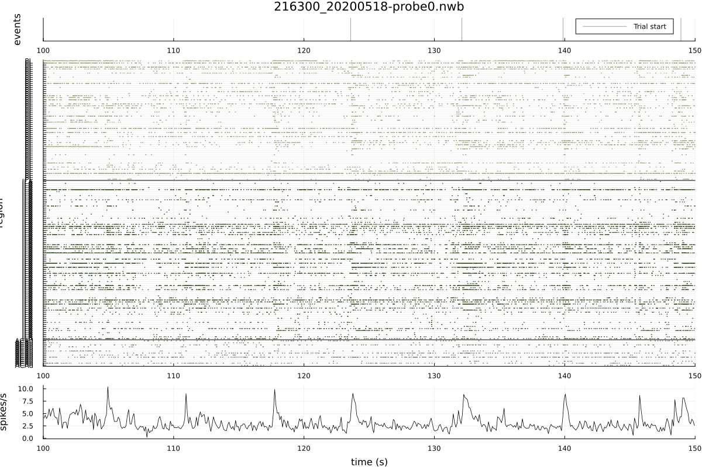
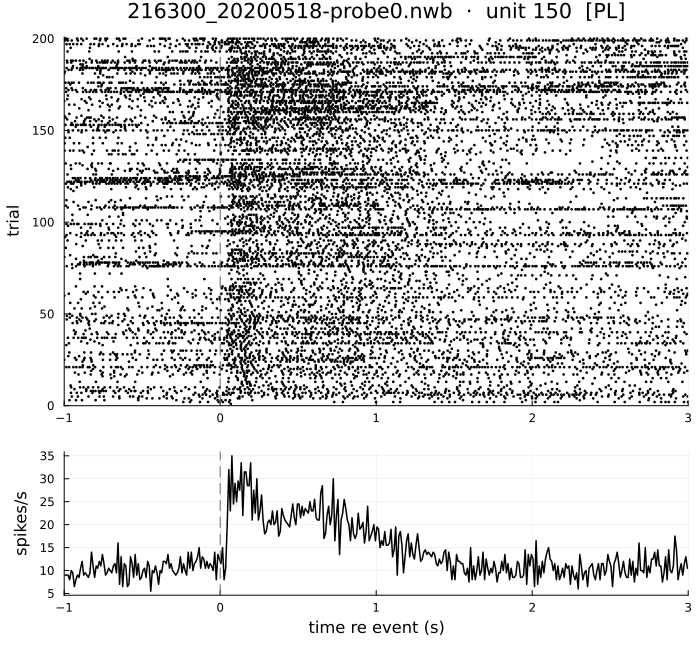
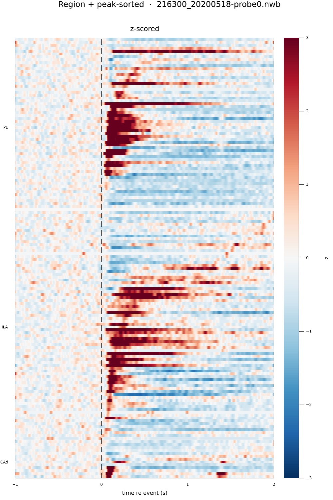
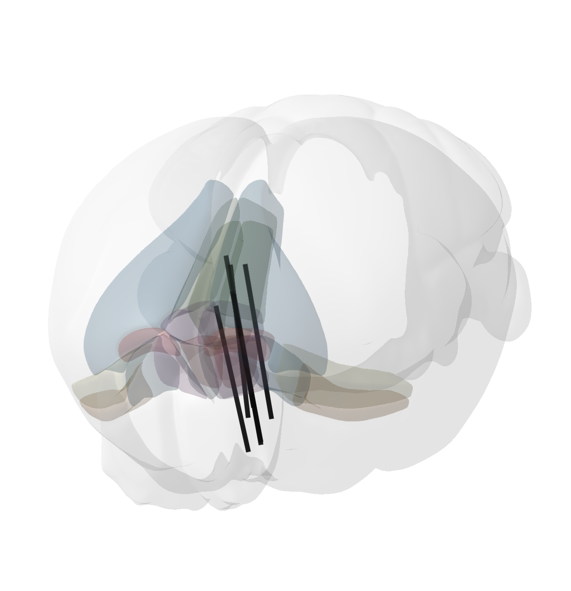

# NeuroTrace: a Julia package for neuronal data analysis from NWB files

Neurotrace is aimed to work with NWB files using Julia. Everything is verymuch under construction right now....bear with me while I develop my first Julia package...

here is what it can do so far....

## Session Overview

Get an idea of what data is in your NWB file with a quick overview.

    

## Quick Raster plot and PSTH

Plot the raster and the psth of any unit in your NWB file and save the plot as png or svg.

    

## Z-scored Heatmap

Get an overview of the z-scored responses of all your units in your NWB file to a particular behavioral timestamp.

    

## 3D viewer

Get the position of your probes in the Allen Brain Atlas CCFv3.

    

